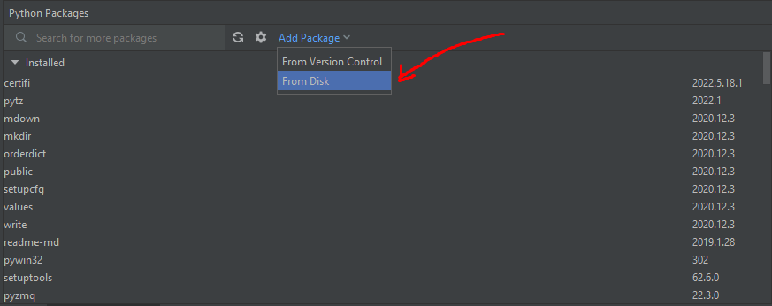
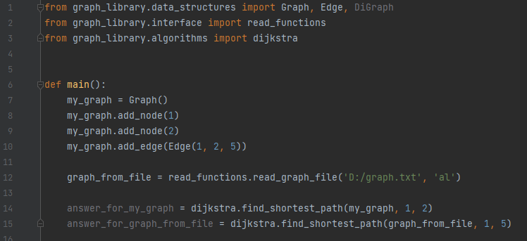

# GraphLib
####Авторы: Овчинников Павел КН-202, Яскевич Михаил КН-202.
####В этом проекте вы можете найти структуры данных для представления графа и некоторые наиболее известные алгоритмы поиска пути в графе.
####Вы можете использовать main.py для того, чтобы:
1) Найти пути в графе от одной вершины до всех или путь от одной вершины до конкретной вершины.
2) Сделать новый отчет о сравнении алгоритмов по использованию времени и памяти, основанный на случайно сгенерированных данных.
3) Запустить все модульные тесты в проекте.
4) Визуализировать результат поиска в графе

####Также вы можете импортировать эту библиотеку к себе в проект, чтобы воспользоваться функциями поиска пути в графе.
####Работа с библиотекой описана подробнее ниже

####Примеры запуска:
####1) Help для всех типов запуска
...\GraphLib>python main.py -h
####2) Help для запуска типа find_path (поиск пути)
...\GraphLib>python main.py find_path -h
####3) Help для запуска типа report (отчет)
...\GraphLib>python main.py report -h
####4) Help для запуска типа test
...\GraphLib>python main.py test -h
####5) Help для запуска типа visualize (визуализация результата)
...\GraphLib>python main.py visualize -h

####Заранее подготовленные графы в виде txt файлов хранятся в GraphLib\resources\graphs
####Пример использования графа из ресурсов:
...\GraphLib>python main.py find_path GraphLib\resources\graphs\graph1.txt al dijkstra
####Более подробная информация об аргументах находится в help для конкретного типа запуска

####Работа с библиотекой:

Для добавления библиотеки в PyCharm сначала нужно ее установить, для этого во вкладке Python Packages нужно нажать 'Add Package' и выбрать 'From Disk'
Для установки библиотеки через консоль нужно написать pip install путь_до_проекта 

После этого выбрать папку с проектом

И нажать OK.

После этого можно импортировать библиотеку, написав import graph_library.
После этого можно будет импортировать нужные вам функции и/или cтруктуры данных

Пример использования библиотеки

Здесь в методе main сначала создаётся граф, потом в него добавляются две вершины с названиями 1 и 2, после этого они соединяются ребром с весом 5.
После этого создаётся еще один граф, который читается из файла, в котором он представлен в виде списков смежности (поэтому второй параметр = 'al', в случае матрицы весов второй аргумент был бы 'wm')
После этого используется импортированная функция dijkstra, которая находит кратчайший путь в графе

Всю информацию о функциях и классах можно найти в докстрингах